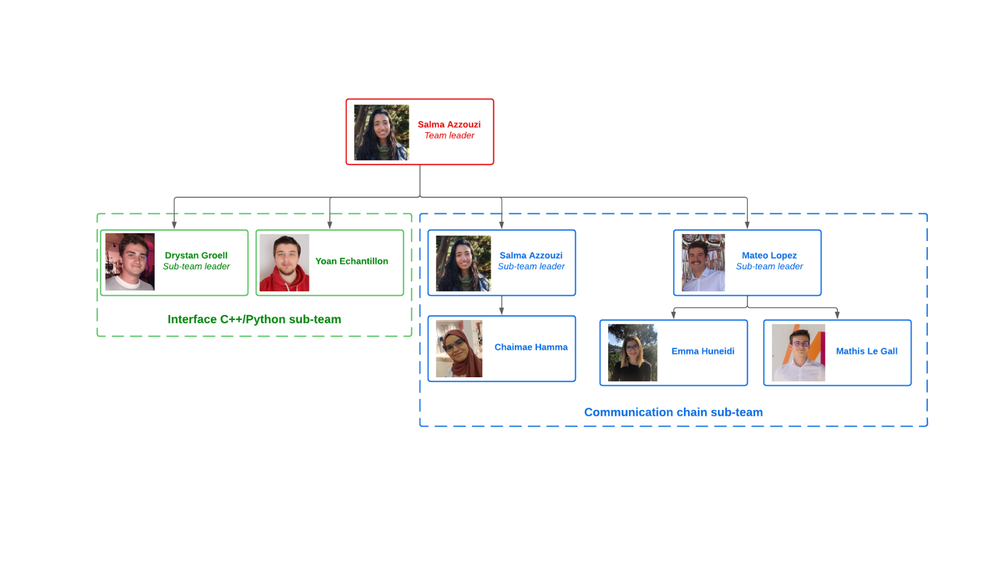

The main issue in communications is ensuring a reliable transfer of data. In order to do so, many channels and system
models have been implemented with tractable mathematical models. In this regard, AFF3CT is a library that is used to
implement the physical layer of most current and future standards (WiFi, 4G, 5G ...). Today’s communication systems have
been thoroughly optimized making them very efficient and stable. Introducing deep learning into such systems may not be
as efficient in communications as it is in other fields such as speech recognition and computer vision. However, it is believed
that it would have remarkable results in complex communications scenarios that are difficult to describe with mathematical
modeling and analysis. Therefore, the aim of this project is to introduce deep learning into existing digital communication
models using PyTorch, a machine learning framework. Simulation times in Python are slower than those in C++; to address
this issue, an interface between Python and C++ was implemented.

***Project Management***

Agile methodology was used during the project. Short-term goals were defined, and the final objectives had been adapted throughout the project, as it evolved. I was also introduced to the responsability of project manager during a semester with a team composed of 7 members.
